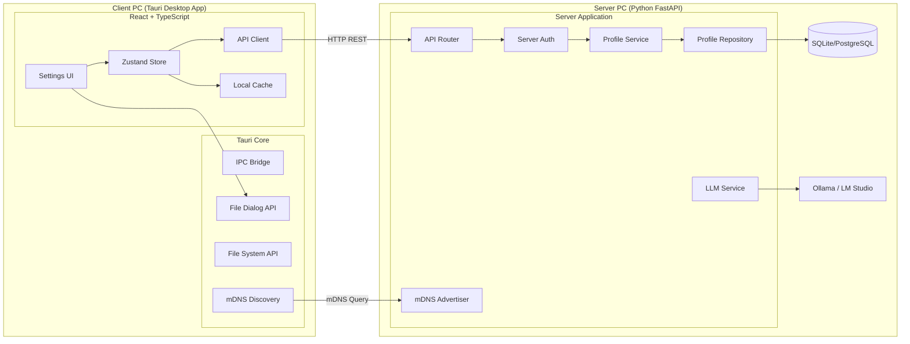

# Design Document: 환경설정 프로필 관리 (settings-profile)

## Overview

환경설정 프로필 관리 기능은 CM단 월간보고서 자동취합 애플리케이션에서 현장별·양식별·발주처별 보고서 생성 기준정보를 관리하는 핵심 기능이다. 사용자는 여러 프로필을 생성하여 다양한 보고서 시나리오에 대응하고, 프로필 내보내기/가져오기를 통해 PC 간 설정을 이전할 수 있다.

### 핵심 설계 결정

1. **서버-클라이언트 아키텍처**: 프로필 데이터는 서버의 중앙 DB에 저장하며, 클라이언트는 서버 API를 통해 CRUD를 수행한다. 클라이언트는 로컬 캐시를 유지하여 서버 연결 끊김 시 읽기 전용 조회를 지원한다.
2. **서버 발견 및 인증**: mDNS/DNS-SD 기반으로 동일 네트워크 내 서버를 자동 탐색하며, Server-ID (UUID v4)로 IP 변경에 무관하게 서버를 인증한다.
3. **LLM 서버 자원 활용**: 모든 LLM 작업(요약, 분류 보조, 문체 변환)은 서버의 LLM API를 호출한다. 클라이언트는 자체 LLM을 실행하지 않는다.
4. **단일 기본 프로필 제약**: 시스템에 Default Profile은 항상 정확히 하나만 존재하도록 서버 트랜잭션 레벨에서 보장한다.
5. **JSON 직렬화 라운드트립**: 내보내기/가져오기 시 데이터 무결성을 UTF-8 JSON으로 보장한다.
6. **네트워크 독립**: 인터넷 아웃바운드 요청 없음. 동일 LAN 내 서버-클라이언트 간 HTTP 통신만 허용.
7. **서버 중복 방지**: 동일 네트워크에 서버는 하나만 존재 가능. 설치 시 mDNS로 기존 서버를 확인.

## Architecture

### 시스템 아키텍처



### 통신 흐름

1. **클라이언트 시작 시**: mDNS로 서버 탐색 → Server-ID 확인 → 연결 수립
2. **UI → Zustand Store**: 사용자 액션을 상태 관리로 전달
3. **Store → API Client**: 서버 REST API 호출
4. **API Client → Server Router**: HTTP 요청 (Server-ID 토큰 헤더 포함)
5. **Router → Auth → Service → Repository → DB**: 레이어드 아키텍처로 데이터 처리
6. **응답 → Store → LocalCache**: 성공 응답을 로컬 캐시에 저장
7. **서버 연결 끊김 시**: LocalCache에서 읽기 전용 데이터 제공

### 서버 레이어 구조

```
┌─────────────────────────────────────────────┐
│  mDNS Advertiser                             │
│  - _cm-report-server._tcp.local. 서비스 광고  │
│  - Server-ID, 포트, 버전 정보 제공            │
├─────────────────────────────────────────────┤
│  API Layer (FastAPI Router)                  │
│  - 요청 유효성 검증 (Pydantic)               │
│  - Server-ID 토큰 인증                       │
│  - HTTP 상태 코드 매핑                       │
├─────────────────────────────────────────────┤
│  Service Layer (ProfileService)              │
│  - 비즈니스 로직 (중복 검사, 기본 프로필 관리)  │
│  - 트랜잭션 관리                             │
├─────────────────────────────────────────────┤
│  Repository Layer (ProfileRepository)        │
│  - SQLAlchemy ORM 쿼리                      │
│  - 데이터 접근 추상화                        │
├─────────────────────────────────────────────┤
│  Database (SQLite / PostgreSQL)              │
│  - 중앙 데이터 저장소                        │
└─────────────────────────────────────────────┘
```

### 클라이언트 레이어 구조

```
┌─────────────────────────────────────────────┐
│  Tauri Shell (Desktop Window)               │
│  - Windows 전용 배포                         │
├─────────────────────────────────────────────┤
│  React UI Layer                             │
│  - Settings Page → Profile Tab              │
│  - 폼, 대화상자, 목록 컴포넌트               │
├─────────────────────────────────────────────┤
│  State Layer (Zustand)                      │
│  - 프로필 상태, 서버 연결 상태 관리           │
│  - 로컬 캐시 동기화                          │
├─────────────────────────────────────────────┤
│  API Client + mDNS Discovery                │
│  - 서버 자동 탐색                            │
│  - REST API 호출 (Server-ID 토큰)           │
│  - 연결 상태 모니터링                        │
├─────────────────────────────────────────────┤
│  Local Cache (IndexedDB / JSON file)        │
│  - 프로필 목록 읽기 전용 캐시                │
│  - 서버 연결 끊김 시 fallback                │
└─────────────────────────────────────────────┘
```

## Components and Interfaces

### Backend Components

#### 1. API Router (`app/routers/profile_router.py`)

| Endpoint | Method | 설명 |
|----------|--------|------|
| `/api/v1/profiles` | GET | 프로필 목록 조회 |
| `/api/v1/profiles` | POST | 프로필 생성 |
| `/api/v1/profiles/{profile_id}` | GET | 프로필 상세 조회 |
| `/api/v1/profiles/{profile_id}` | PUT | 프로필 수정 |
| `/api/v1/profiles/{profile_id}` | DELETE | 프로필 삭제 |
| `/api/v1/profiles/{profile_id}/copy` | POST | 프로필 복사 |
| `/api/v1/profiles/{profile_id}/default` | PUT | 기본 프로필 지정 |
| `/api/v1/profiles/{profile_id}/export` | GET | 프로필 내보내기 (JSON 반환) |
| `/api/v1/profiles/import` | POST | 프로필 가져오기 (JSON 업로드) |

#### 2. Service Layer (`app/services/profile_service.py`)

```python
class ProfileService:
    def create_profile(self, data: ProfileCreate) -> Profile
    def update_profile(self, profile_id: int, data: ProfileUpdate) -> Profile
    def delete_profile(self, profile_id: int) -> None
    def copy_profile(self, profile_id: int) -> Profile
    def set_default_profile(self, profile_id: int) -> Profile
    def get_profile(self, profile_id: int) -> Profile
    def list_profiles(self) -> list[Profile]
    def export_profile(self, profile_id: int) -> dict
    def import_profile(self, data: dict) -> Profile
```

#### 3. Repository Layer (`app/repositories/profile_repository.py`)

```python
class ProfileRepository:
    def create(self, profile: SettingsProfile) -> SettingsProfile
    def get_by_id(self, profile_id: int) -> SettingsProfile | None
    def get_by_name(self, name: str) -> SettingsProfile | None
    def get_default(self) -> SettingsProfile | None
    def list_all(self) -> list[SettingsProfile]
    def update(self, profile: SettingsProfile) -> SettingsProfile
    def delete(self, profile_id: int) -> None
    def count(self) -> int
```

### Frontend Components

#### 1. 페이지 / 컨테이너

| 컴포넌트 | 경로 | 설명 |
|----------|------|------|
| `SettingsPage` | `/settings` | 환경설정 메인 페이지 |
| `ProfileTab` | - | 프로필 관리 탭 컨테이너 |
| `ProfileDetailPanel` | - | 프로필 상세 정보 패널 |

#### 2. UI 컴포넌트

| 컴포넌트 | 설명 |
|----------|------|
| `ProfileList` | 프로필 목록 렌더링 |
| `ProfileListItem` | 개별 프로필 항목 (이름, 설명, 기본 배지, 수정일) |
| `ProfileForm` | 프로필 생성/수정 폼 |
| `ProfileActions` | 복사, 내보내기, 삭제 액션 버튼 그룹 |
| `DeleteConfirmDialog` | 삭제 확인 대화상자 |
| `ImportDialog` | 가져오기 시 이름 충돌 해결 대화상자 |
| `EmptyProfileState` | 프로필 없을 때 안내 메시지 |

#### 3. 상태 관리 (Zustand Store)

```typescript
interface ProfileStore {
  profiles: Profile[];
  selectedProfileId: number | null;
  isLoading: boolean;
  error: string | null;
  
  // Actions
  fetchProfiles: () => Promise<void>;
  createProfile: (data: ProfileCreateInput) => Promise<void>;
  updateProfile: (id: number, data: ProfileUpdateInput) => Promise<void>;
  deleteProfile: (id: number) => Promise<void>;
  copyProfile: (id: number) => Promise<void>;
  setDefaultProfile: (id: number) => Promise<void>;
  exportProfile: (id: number) => Promise<void>;
  importProfile: (file: File) => Promise<void>;
}
```

### Tauri IPC Interface

```typescript
// Tauri command invocations
import { invoke } from '@tauri-apps/api/core';
import { open, save } from '@tauri-apps/plugin-dialog';

// 파일 대화상자 (내보내기)
const savePath = await save({
  defaultPath: `profile_${sanitizedName}_${date}.json`,
  filters: [{ name: 'JSON', extensions: ['json'] }]
});

// 파일 대화상자 (가져오기)
const filePath = await open({
  filters: [{ name: 'JSON', extensions: ['json'] }],
  multiple: false
});
```

## Data Models

### SQLite 테이블 스키마

#### `settings_profile` 테이블

| 컬럼명 | 타입 | 제약조건 | 설명 |
|--------|------|----------|------|
| `id` | INTEGER | PRIMARY KEY AUTOINCREMENT | 프로필 고유 ID |
| `name` | TEXT | NOT NULL, UNIQUE | 프로필명 (1~50자) |
| `description` | TEXT | DEFAULT '' | 프로필 설명 (최대 200자) |
| `is_default` | BOOLEAN | NOT NULL DEFAULT FALSE | 기본 프로필 여부 |
| `created_at` | TEXT | NOT NULL | 생성 시각 (ISO 8601) |
| `updated_at` | TEXT | NOT NULL | 수정 시각 (ISO 8601) |

#### 인덱스

```sql
CREATE UNIQUE INDEX idx_profile_name ON settings_profile(name);
CREATE INDEX idx_profile_is_default ON settings_profile(is_default);
CREATE INDEX idx_profile_updated_at ON settings_profile(updated_at);
```

### SQLAlchemy ORM Model

```python
from sqlalchemy import Column, Integer, Text, Boolean, DateTime
from sqlalchemy.orm import declarative_base
from datetime import datetime, timezone

Base = declarative_base()

class SettingsProfile(Base):
    __tablename__ = "settings_profile"

    id = Column(Integer, primary_key=True, autoincrement=True)
    name = Column(Text, nullable=False, unique=True)
    description = Column(Text, default="")
    is_default = Column(Boolean, nullable=False, default=False)
    created_at = Column(Text, nullable=False)
    updated_at = Column(Text, nullable=False)
```

### Pydantic Schemas

```python
from pydantic import BaseModel, Field, field_validator
from datetime import datetime

class ProfileCreate(BaseModel):
    name: str = Field(..., min_length=1, max_length=50)
    description: str = Field(default="", max_length=200)

    @field_validator("name")
    @classmethod
    def validate_name(cls, v: str) -> str:
        stripped = v.strip()
        if not stripped:
            raise ValueError("프로필명은 필수 입력값입니다.")
        if len(stripped) > 50:
            raise ValueError("프로필명은 50자를 초과할 수 없습니다.")
        return stripped

class ProfileUpdate(BaseModel):
    name: str | None = Field(default=None, min_length=1, max_length=50)
    description: str | None = Field(default=None, max_length=200)

    @field_validator("name")
    @classmethod
    def validate_name(cls, v: str | None) -> str | None:
        if v is None:
            return v
        stripped = v.strip()
        if not stripped:
            raise ValueError("프로필명은 필수 입력값입니다.")
        if len(stripped) > 50:
            raise ValueError("프로필명은 50자를 초과할 수 없습니다.")
        return stripped

class ProfileResponse(BaseModel):
    id: int
    name: str
    description: str
    is_default: bool
    created_at: str
    updated_at: str

    class Config:
        from_attributes = True

class ProfileListResponse(BaseModel):
    profiles: list[ProfileResponse]
    total: int
```

### TypeScript 인터페이스

```typescript
interface Profile {
  id: number;
  name: string;
  description: string;
  is_default: boolean;
  created_at: string;
  updated_at: string;
}

interface ProfileCreateInput {
  name: string;
  description?: string;
}

interface ProfileUpdateInput {
  name?: string;
  description?: string;
}

interface ProfileListResponse {
  profiles: Profile[];
  total: number;
}
```

### 내보내기/가져오기 JSON 스키마

```json
{
  "$schema": "http://json-schema.org/draft-07/schema#",
  "title": "ProfileExport",
  "type": "object",
  "required": ["version", "profile"],
  "properties": {
    "version": {
      "type": "string",
      "const": "1.0",
      "description": "내보내기 스키마 버전"
    },
    "exported_at": {
      "type": "string",
      "format": "date-time",
      "description": "내보내기 시각 (ISO 8601)"
    },
    "profile": {
      "type": "object",
      "required": ["name"],
      "properties": {
        "name": {
          "type": "string",
          "minLength": 1,
          "maxLength": 50
        },
        "description": {
          "type": "string",
          "maxLength": 200
        },
        "is_default": {
          "type": "boolean"
        },
        "created_at": {
          "type": "string",
          "format": "date-time"
        },
        "updated_at": {
          "type": "string",
          "format": "date-time"
        }
      }
    },
    "settings": {
      "type": "object",
      "properties": {
        "document_type_configs": {
          "type": "array",
          "items": { "type": "object" }
        },
        "folder_configs": {
          "type": "array",
          "items": { "type": "object" }
        },
        "template_mappings": {
          "type": "array",
          "items": { "type": "object" }
        }
      }
    }
  }
}
```


## Correctness Properties

*A property is a characteristic or behavior that should hold true across all valid executions of a system—essentially, a formal statement about what the system should do. Properties serve as the bridge between human-readable specifications and machine-verifiable correctness guarantees.*

### Property 1: 프로필 생성 라운드트립

*For any* 유효한 ProfileCreate 입력(공백 제거 후 1~50자의 이름, 0~200자의 설명), 프로필 생성 후 해당 프로필을 조회하면 입력한 name과 description이 동일하게 반환되어야 한다.

**Validates: Requirements 1.1, 1.2, 1.3**

### Property 2: 프로필 수정 라운드트립

*For any* 기존 프로필과 유효한 ProfileUpdate 입력(공백 제거 후 1~50자의 이름, 0~200자의 설명), 수정 후 해당 프로필을 조회하면 변경한 name과 description이 동일하게 반환되고 updated_at이 수정 시점 이후여야 한다.

**Validates: Requirements 2.1, 2.2**

### Property 3: 이름 유효성 검증 — 공백 및 길이 초과 거부

*For any* 공백 문자(space, tab, newline 등)만으로 구성된 문자열 또는 공백 제거 후 51자 이상인 문자열을 Profile_Name으로 사용하여 생성 또는 수정을 시도하면, 시스템은 해당 요청을 거부하고 기존 데이터를 변경하지 않아야 한다.

**Validates: Requirements 1.4, 1.7, 2.3, 2.6**

### Property 4: 이름 유니크 제약

*For any* 두 개의 프로필에 대해, 하나의 프로필명을 다른 프로필명과 앞뒤 공백 제거 후 대소문자 무관하게 동일한 값으로 생성 또는 수정하면, 시스템은 해당 요청을 거부해야 한다.

**Validates: Requirements 1.5, 2.4**

### Property 5: 기본 프로필 단일성 불변식

*For any* 프로필 생성, 수정, 삭제, 복사, 기본 프로필 지정 작업 후, 시스템에 프로필이 1개 이상 존재하면 is_default=true인 프로필은 정확히 1개여야 한다.

**Validates: Requirements 5.1, 5.2, 5.3, 1.6, 4.4**

### Property 6: 프로필 복사 속성 일관성

*For any* 기존 프로필을 복사하면, 복사본의 description은 원본과 동일하고, is_default는 false이며, created_at과 updated_at은 복사 시점 이후이고, name은 "원본이름 (복사본)" 형식이어야 한다.

**Validates: Requirements 3.2, 3.3, 3.4**

### Property 7: 복사본 이름 순번 증가

*For any* 프로필을 N번(N ≥ 2) 연속 복사하면, 각 복사본의 이름은 고유해야 하며, "원본이름 (복사본)", "원본이름 (복사본 2)", ..., "원본이름 (복사본 N)" 패턴으로 순번이 증가해야 한다.

**Validates: Requirements 3.5**

### Property 8: 기본 프로필 삭제 시 위임

*For any* 2개 이상의 프로필이 존재하는 시스템에서 기본 프로필을 삭제하면, 삭제 후 남은 프로필 중 updated_at이 가장 최신인 프로필이 새로운 기본 프로필로 지정되어야 한다.

**Validates: Requirements 4.4**

### Property 9: 직렬화 라운드트립

*For any* 유효한 Profile 객체를 내보내기(JSON 직렬화) 후 가져오기(JSON 역직렬화)를 수행하면, 복원된 프로필의 name과 description은 원본과 바이트 단위로 동일해야 한다.

**Validates: Requirements 10.1, 10.2, 10.3**

### Property 10: 잘못된 JSON 가져오기 거부

*For any* 유효한 JSON이 아닌 바이트열 또는 필수 필드(name)가 누락된 JSON 객체를 가져오기하면, 시스템은 가져오기를 거부하고 기존 프로필 데이터를 변경하지 않아야 한다.

**Validates: Requirements 7.3, 7.4, 9.5, 10.4**

### Property 11: 내보내기 파일명 특수문자 치환

*For any* 프로필명에 파일시스템 금지 문자(\ / : * ? " < > |)가 포함된 경우, 내보내기 파일명 생성 시 해당 문자는 모두 언더스코어(_)로 치환되어야 하며, 결과 파일명에 금지 문자가 포함되지 않아야 한다.

**Validates: Requirements 6.3**

### Property 12: 목록 정렬 불변식

*For any* 1개 이상의 프로필이 존재하는 시스템에서 목록을 조회하면, 첫 번째 항목은 반드시 기본 프로필이어야 하며, 나머지 항목은 updated_at 내림차순으로 정렬되어야 한다.

**Validates: Requirements 8.3, 8.4**

## Error Handling

### 에러 분류 체계

| 에러 카테고리 | HTTP 상태 코드 | 설명 |
|--------------|---------------|------|
| 유효성 검증 오류 | 422 | 입력값 제약 위반 (이름 길이, 빈 값, 설명 길이 등) |
| 중복 오류 | 409 | 프로필명 중복 |
| 리소스 없음 | 404 | 존재하지 않는 프로필 ID |
| 비즈니스 규칙 위반 | 400 | 마지막 프로필 삭제 시도 등 |
| 파일 처리 오류 | 400 | JSON 파싱 실패, 파일 크기 초과 |
| 시스템 오류 | 500 | DB 접근 실패, 내부 오류 |

### 에러 응답 형식

```python
class ErrorResponse(BaseModel):
    error_code: str       # 머신 판독용 에러 코드
    message: str          # 사용자 표시 메시지
    detail: str | None    # 개발자용 상세 정보
    field: str | None     # 유효성 오류 시 필드명

# 에러 코드 정의
class ErrorCodes:
    PROFILE_NAME_REQUIRED = "PROFILE_NAME_REQUIRED"
    PROFILE_NAME_TOO_LONG = "PROFILE_NAME_TOO_LONG"
    PROFILE_DESC_TOO_LONG = "PROFILE_DESC_TOO_LONG"
    PROFILE_NAME_DUPLICATE = "PROFILE_NAME_DUPLICATE"
    PROFILE_NOT_FOUND = "PROFILE_NOT_FOUND"
    PROFILE_LAST_DELETE = "PROFILE_LAST_DELETE"
    IMPORT_INVALID_JSON = "IMPORT_INVALID_JSON"
    IMPORT_MISSING_FIELD = "IMPORT_MISSING_FIELD"
    IMPORT_FILE_TOO_LARGE = "IMPORT_FILE_TOO_LARGE"
    EXPORT_SAVE_FAILED = "EXPORT_SAVE_FAILED"
    DATABASE_ERROR = "DATABASE_ERROR"
```

### 트랜잭션 및 롤백 전략

- 프로필 복사: 원본 조회 → 복사본 생성을 단일 트랜잭션으로 처리. 실패 시 전체 롤백.
- 기본 프로필 변경: 기존 기본 해제 + 새 기본 설정을 단일 트랜잭션으로 처리.
- 프로필 삭제: 하위 데이터 삭제 + 프로필 삭제 + (필요 시) 새 기본 지정을 단일 트랜잭션으로 처리.

```python
# 트랜잭션 패턴 예시
async def delete_profile(self, profile_id: int) -> None:
    async with self.db.begin():
        profile = await self.repo.get_by_id(profile_id)
        if not profile:
            raise ProfileNotFoundError(profile_id)
        
        total = await self.repo.count()
        if total <= 1:
            raise LastProfileDeleteError()
        
        was_default = profile.is_default
        await self.repo.delete(profile_id)
        
        if was_default:
            latest = await self.repo.get_latest_updated()
            latest.is_default = True
            await self.repo.update(latest)
```

### 프론트엔드 에러 처리

```typescript
// API 에러 매핑
const ERROR_MESSAGES: Record<string, string> = {
  PROFILE_NAME_REQUIRED: "프로필명은 필수 입력값입니다.",
  PROFILE_NAME_TOO_LONG: "프로필명은 50자를 초과할 수 없습니다.",
  PROFILE_DESC_TOO_LONG: "설명은 200자를 초과할 수 없습니다.",
  PROFILE_NAME_DUPLICATE: "동일한 이름의 프로필이 이미 존재합니다.",
  PROFILE_NOT_FOUND: "해당 프로필을 찾을 수 없습니다.",
  PROFILE_LAST_DELETE: "최소 1개의 프로필이 필요합니다. 마지막 프로필은 삭제할 수 없습니다.",
  IMPORT_INVALID_JSON: "유효하지 않은 JSON 파일입니다.",
  IMPORT_MISSING_FIELD: "필수 항목(프로필명)이 누락되었습니다.",
  IMPORT_FILE_TOO_LARGE: "파일 크기가 10MB를 초과합니다.",
  DATABASE_ERROR: "데이터베이스 접근에 실패했습니다. 앱을 재시작해 주세요.",
};
```

## Security Considerations

### 서버-클라이언트 보안 모델

1. **네트워크 격리**: 서버는 동일 LAN 내에서만 접근 가능하며, 인터넷으로의 아웃바운드 트래픽은 발생하지 않는다.
2. **Server-ID 토큰 인증**: 클라이언트는 서버 등록 시 받은 Server-ID 기반 토큰을 모든 API 요청 헤더에 포함한다. 유효하지 않은 토큰은 거부한다.
3. **서버 중복 방지**: 동일 네트워크에 서버는 하나만 존재할 수 있으며, 설치 시 mDNS로 기존 서버를 확인한다.
4. **입력 검증**: 모든 사용자 입력은 Pydantic 모델로 검증하며, SQL injection은 SQLAlchemy ORM으로 방지한다.
5. **파일 접근 제한**: 가져오기 시 사용자가 선택한 파일만 읽으며, 임의의 경로 접근을 차단한다.
6. **파일 크기 제한**: 가져오기 파일은 10MB 이하로 제한하여 DoS 방지.
7. **JSON 파싱 안전성**: `json.loads()`로 파싱하되, 재귀 깊이 제한 설정.
8. **외부 요청 차단**: 클라이언트와 서버 모두 인터넷 아웃바운드 HTTP/DNS 요청을 수행하지 않는다.
9. **향후 TLS**: MVP에서는 HTTP를 사용하되, TLS 적용을 위한 인터페이스를 준비한다.

### Tauri 보안 설정 (클라이언트)

```json
{
  "security": {
    "csp": "default-src 'self'; connect-src http://*:*",
    "dangerousDisableAssetCspModification": false
  },
  "allowlist": {
    "dialog": { "open": true, "save": true },
    "fs": { "readFile": true, "writeFile": true, "scope": ["$APPDATA/**"] },
    "http": { "scope": ["http://*:*"] }
  }
}
```

### 서버 설정

```python
# FastAPI 서버 시작 설정
uvicorn.run(
    app,
    host="0.0.0.0",      # LAN 내 모든 인터페이스에서 수신
    port=8741,            # 기본 포트
    log_level="info"
)
```

## Testing Strategy

### 테스트 계층 구조

```
┌──────────────────────────────────────┐
│  E2E Tests (Playwright + Tauri)      │  ← 최소한의 핵심 시나리오
├──────────────────────────────────────┤
│  Integration Tests (FastAPI TestClient)│  ← API 레벨 통합 테스트
├──────────────────────────────────────┤
│  Property-Based Tests (Hypothesis)    │  ← 비즈니스 로직 property 검증
├──────────────────────────────────────┤
│  Unit Tests (pytest)                  │  ← 개별 함수/메서드 검증
└──────────────────────────────────────┘
```

### Property-Based Testing 설정

- **라이브러리**: [Hypothesis](https://hypothesis.readthedocs.io/) (Python)
- **최소 반복 횟수**: 100회 (설정: `@settings(max_examples=100)`)
- **태그 형식**: `# Feature: settings-profile, Property {N}: {property_text}`

### 구현 대상 Property Tests

| Property | 테스트 대상 함수/모듈 | 생성기 |
|----------|---------------------|--------|
| 1. 프로필 생성 라운드트립 | `ProfileService.create_profile` | 유효한 이름(1~50자) + 설명(0~200자) |
| 2. 프로필 수정 라운드트립 | `ProfileService.update_profile` | 유효한 이름 + 설명 |
| 3. 이름 유효성 검증 | `ProfileCreate`, `ProfileUpdate` Pydantic 검증 | 공백 문자열, 51자+ 문자열 |
| 4. 이름 유니크 제약 | `ProfileService.create_profile` | 동일 이름의 대소문자 변형 |
| 5. 기본 프로필 단일성 | `ProfileService` (모든 변경 작업) | 임의의 작업 시퀀스 |
| 6. 프로필 복사 속성 | `ProfileService.copy_profile` | 임의의 유효 프로필 |
| 7. 복사본 이름 순번 | `ProfileService.copy_profile` 반복 호출 | 반복 횟수 N (2~10) |
| 8. 기본 프로필 삭제 위임 | `ProfileService.delete_profile` | 2~10개 프로필 집합 |
| 9. 직렬화 라운드트립 | `export_profile` → `import_profile` | 임의의 유효 프로필 |
| 10. 잘못된 JSON 거부 | `ProfileService.import_profile` | 랜덤 바이트열, 필드 누락 JSON |
| 11. 파일명 특수문자 치환 | `generate_export_filename()` | 특수문자 포함 프로필명 |
| 12. 목록 정렬 불변식 | `ProfileService.list_profiles` | 임의의 프로필 집합 |

### Unit Tests (example-based)

- 첫 번째 프로필 생성 시 자동 기본 지정 (1.6)
- 존재하지 않는 프로필 수정/삭제 시 404 (2.5)
- 마지막 프로필 삭제 방지 (4.5)
- 기본 프로필 있을 때 is_default=true 파일 가져오기 시 false 처리 (7.7)
- 10MB 초과 파일 거부 (7.8)
- 빈 목록 조회 시 빈 배열 반환 (8.5)

### Integration Tests

- 프로필 복사 시 하위 설정 데이터 포함 여부 (3.1)
- 프로필 삭제 시 cascade 동작 (4.2)
- DB 접근 실패 시 적절한 오류 반환 (9.4)
- 전체 CRUD 시나리오 flow

### 프론트엔드 테스트 (Vitest + React Testing Library)

- 컴포넌트 렌더링 테스트
- 폼 유효성 검증 UI 피드백 테스트
- 삭제 확인 대화상자 동작 테스트
- 에러 메시지 표시 테스트
- 빈 상태 안내 메시지 렌더링 테스트
