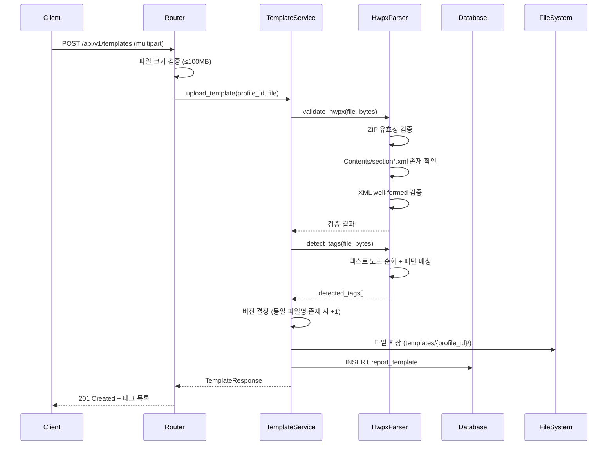

# Design Document: 월간보고서 HWPX 양식 등록 (template-registration)

## Overview

HWPX 양식 등록은 월간보고서 자동 생성의 기반이 되는 템플릿 파일을 시스템에 업로드하고, 내부 XML에서 데이터 삽입 태그를 자동 탐지하는 기능이다. 등록된 태그는 이후 자동취합 결과를 보고서에 삽입할 때 위치 기준으로 사용된다.

### 핵심 설계 결정

1. **HWPX 파싱**: Python `zipfile` + `lxml`을 사용하여 HWPX(ZIP) 내부 `Contents/section*.xml`에서 태그를 탐지한다.
2. **파일 저장 전략**: 업로드된 HWPX 파일은 `{DATA_DIR}/templates/{profile_id}/` 디렉토리에 저장하며, 버전 관리 시 `{원본명}_v{version}.hwpx` 형식으로 별도 저장한다.
3. **태그 탐지 방식**: 사전 정의된 20개 태그 + `[A-Z][A-Z0-9_]{2,}` 정규식 패턴으로 커스텀 태그를 추가 탐지한다.
4. **프로필 종속**: `report_template.profile_id` FK로 프로필에 종속되며, 프로필 삭제 시 CASCADE로 템플릿도 함께 삭제된다.
5. **파일 업로드**: multipart/form-data로 전송하며 서버에서 100MB 크기 제한을 적용한다.
6. **detected_tags JSON 구조**: 태그명, 섹션 파일명, 발생 위치를 JSON 배열로 직렬화하여 TEXT 컬럼에 저장한다.

## Architecture

### 서버 레이어 구조 (기존 패턴 동일)

```
┌─────────────────────────────────────────────┐
│  API Layer (template_router.py)             │
│  - 파일 업로드 (multipart/form-data)        │
│  - Pydantic 유효성 검증                     │
│  - Server-ID 토큰 인증                      │
├─────────────────────────────────────────────┤
│  Service Layer (template_service.py)        │
│  - HWPX 유효성 검증                         │
│  - 태그 탐지 오케스트레이션                  │
│  - 버전 관리 로직                           │
│  - 파일 저장 로직                           │
├─────────────────────────────────────────────┤
│  Parser Module (hwpx_parser.py)             │
│  - ZIP 해제 + Section XML 파싱              │
│  - 태그 패턴 매칭                           │
├─────────────────────────────────────────────┤
│  Repository Layer (template_repository.py)  │
│  - SQLAlchemy ORM 쿼리                      │
├─────────────────────────────────────────────┤
│  Database (SQLite)                          │
│  - report_template 테이블                   │
└─────────────────────────────────────────────┘
```

### 파일 시스템 구조

```
{DATA_DIR}/
├── cm_report.db
└── templates/
    └── {profile_id}/
        ├── report_template.hwpx          # 최초 업로드 (v1)
        ├── report_template_v2.hwpx       # 재업로드 (v2)
        └── other_template.hwpx
```

### 업로드 처리 흐름



## Components and Interfaces

### Backend Components

#### 1. API Router (`app/routers/template_router.py`)

| Endpoint | Method | 설명 |
|----------|--------|------|
| `/api/v1/templates` | GET | 현재 프로필의 템플릿 목록 조회 |
| `/api/v1/templates` | POST | 템플릿 업로드 (multipart/form-data) |
| `/api/v1/templates/{template_id}` | GET | 템플릿 상세 조회 (태그 포함) |
| `/api/v1/templates/{template_id}` | DELETE | 템플릿 삭제 (DB + 파일) |
| `/api/v1/templates/{template_id}/tags` | PUT | 태그 매핑 수정 |
| `/api/v1/templates/{template_id}/preview` | GET | 구조 미리보기 (섹션+태그 트리) |

모든 엔드포인트는 `profile_id` 쿼리 파라미터를 필수로 받는다.

#### 2. Service Layer (`app/services/template_service.py`)

```python
class TemplateService:
    async def upload_template(self, profile_id: int, file: UploadFile) -> ReportTemplate
    async def list_templates(self, profile_id: int) -> list[ReportTemplate]
    async def get_template(self, template_id: int) -> ReportTemplate
    async def delete_template(self, template_id: int) -> None
    async def update_tags(self, template_id: int, tags: list[dict]) -> ReportTemplate
    async def get_preview(self, template_id: int) -> dict
```

#### 3. HWPX Parser (`app/services/hwpx_parser.py`)

```python
class HwpxParser:
    def validate(self, file_bytes: bytes) -> ValidationResult
    def detect_tags(self, file_bytes: bytes) -> list[DetectedTag]
    def get_structure(self, file_bytes: bytes) -> list[SectionInfo]
```

#### 4. Repository Layer (`app/repositories/template_repository.py`)

```python
class TemplateRepository:
    async def create(self, template: ReportTemplate) -> ReportTemplate
    async def get_by_id(self, template_id: int) -> ReportTemplate | None
    async def list_by_profile(self, profile_id: int) -> list[ReportTemplate]
    async def get_by_profile_and_filename(self, profile_id: int, filename: str) -> list[ReportTemplate]
    async def delete(self, template_id: int) -> None
    async def update(self, template: ReportTemplate) -> ReportTemplate
```

### Frontend Components

#### 1. 신규 탭: "양식" (`TemplateTab`)

`SettingsPage`의 `TABS` 배열에 `{ id: 'template', label: '양식' }` 추가.

#### 2. UI 컴포넌트

| 컴포넌트 | 설명 |
|----------|------|
| `TemplateTab` | 양식 탭 컨테이너 (목록 + 상세) |
| `TemplateList` | 템플릿 목록 렌더링 |
| `TemplateListItem` | 개별 항목 (파일명, 버전, 태그 수, 생성일) |
| `TemplateUploadButton` | 업로드 버튼 + 파일 선택 대화상자 |
| `TemplateDetail` | 템플릿 상세 (태그 목록 + 미리보기) |
| `TagEditor` | 태그 추가/삭제 편집 UI |
| `TemplatePreview` | 섹션+태그 트리 구조 미리보기 |
| `EmptyTemplateState` | 템플릿 없을 때 안내 |
| `DeleteTemplateDialog` | 삭제 확인 대화상자 |

#### 3. 상태 관리 (`stores/templateStore.ts`)

```typescript
interface TemplateStore {
  templates: Template[];
  selectedTemplateId: number | null;
  isLoading: boolean;
  isUploading: boolean;
  error: string | null;

  fetchTemplates: (profileId: number) => Promise<void>;
  uploadTemplate: (profileId: number, file: File) => Promise<void>;
  deleteTemplate: (id: number) => Promise<void>;
  updateTags: (id: number, tags: TagMapping[]) => Promise<void>;
  selectTemplate: (id: number | null) => void;
}
```

#### 4. API Client (`api/templateApi.ts`)

```typescript
export async function uploadTemplate(profileId: number, file: File): Promise<Template>
export async function listTemplates(profileId: number): Promise<TemplateListResponse>
export async function getTemplate(id: number): Promise<Template>
export async function deleteTemplate(id: number): Promise<void>
export async function updateTags(id: number, tags: TagMapping[]): Promise<Template>
export async function getPreview(id: number): Promise<TemplatePreview>
```

## Data Models

### SQLAlchemy ORM Model (`app/models/report_template.py`)

```python
from sqlalchemy import Column, ForeignKey, Index, Integer, Text
from app.core.database import Base


class ReportTemplate(Base):
    """HWPX 월간보고서 템플릿 ORM 모델."""

    __tablename__ = "report_template"

    id = Column(Integer, primary_key=True, autoincrement=True)
    profile_id = Column(
        Integer,
        ForeignKey("settings_profile.id", ondelete="CASCADE"),
        nullable=False,
    )
    original_file_name = Column(Text, nullable=False)
    stored_path = Column(Text, nullable=False)
    file_type = Column(Text, nullable=False, default="hwpx")
    version = Column(Integer, nullable=False, default=1)
    detected_tags = Column(Text, nullable=False, default="[]")  # JSON array
    created_at = Column(Text, nullable=False)

    __table_args__ = (
        Index("idx_template_profile_id", "profile_id"),
        Index("idx_template_created_at", "created_at"),
    )
```

### Pydantic Schemas (`app/schemas/template.py`)

```python
from pydantic import BaseModel, Field


class DetectedTag(BaseModel):
    name: str
    section: str
    position: int
    is_manual: bool = False


class TemplateResponse(BaseModel):
    id: int
    profile_id: int
    original_file_name: str
    file_type: str
    version: int
    detected_tags: list[DetectedTag]
    created_at: str

    class Config:
        from_attributes = True


class TemplateListResponse(BaseModel):
    templates: list[TemplateResponse]
    total: int


class TagUpdateRequest(BaseModel):
    tags: list[DetectedTag]


class SectionPreview(BaseModel):
    filename: str
    tags: list[str]


class TemplatePreviewResponse(BaseModel):
    sections: list[SectionPreview]
    total_tags: int
```

### TypeScript 인터페이스 (`types/template.ts`)

```typescript
interface DetectedTag {
  name: string;
  section: string;
  position: number;
  is_manual: boolean;
}

interface Template {
  id: number;
  profile_id: number;
  original_file_name: string;
  file_type: string;
  version: number;
  detected_tags: DetectedTag[];
  created_at: string;
}

interface TemplateListResponse {
  templates: Template[];
  total: number;
}

interface TagMapping {
  name: string;
  section: string;
  position: number;
  is_manual: boolean;
}

interface SectionPreview {
  filename: string;
  tags: string[];
}

interface TemplatePreview {
  sections: SectionPreview[];
  total_tags: number;
}
```

### 태그 탐지 대상 (사전 정의 목록)

```python
KNOWN_TAGS = [
    "PROJECT_NAME", "WRITE_YYMM", "SUMMARY_TEXT", "REPORT_ROUND",
    "REPORT_PERIOD", "TFA_LIST", "IRR_LIST", "TR_LIST", "DN_LIST",
    "NCR_LIST", "FI_LIST", "SCAR_LIST", "TFA_IMG", "IRR_IMG",
    "DN_IMG", "NCR_IMG", "FI_IMG", "SCAR_IMG",
    "PHOTO_SITE_VIEW", "PHOTO_PROGRESS",
]

# 커스텀 태그 패턴: 대문자 시작, 대문자+숫자+언더스코어 3자 이상
CUSTOM_TAG_PATTERN = re.compile(r'\b[A-Z][A-Z0-9_]{2,}\b')
```


## Correctness Properties

*A property is a characteristic or behavior that should hold true across all valid executions of a system—essentially, a formal statement about what the system should do. Properties serve as the bridge between human-readable specifications and machine-verifiable correctness guarantees.*

### Property 1: HWPX 유효성 검증 — 잘못된 파일 거부

*For any* 바이트 배열이 유효한 ZIP이 아니거나, ZIP 내부에 `Contents/` 디렉토리가 없거나, `Contents/section*.xml` 파일이 하나도 없거나, section XML이 well-formed XML이 아닌 경우, `HwpxParser.validate()`는 해당 파일을 거부하고 적절한 에러 유형을 반환해야 한다.

**Validates: Requirements 2.1, 2.2, 2.3, 2.4, 2.5, 2.6, 2.7**

### Property 2: 태그 탐지 완전성

*For any* 유효한 HWPX 파일 내 section XML에 사전 정의된 태그(KNOWN_TAGS) 또는 커스텀 태그 패턴(`[A-Z][A-Z0-9_]{2,}`)과 매칭되는 텍스트 노드가 N개 존재하면, `detect_tags()`의 결과는 정확히 N개의 항목을 포함하며, 각 항목은 tag_name, section 파일명, position을 포함해야 한다.

**Validates: Requirements 3.1, 3.2, 3.3, 3.5**

### Property 3: detected_tags JSON 라운드트립

*For any* 유효한 DetectedTag 객체 리스트를 JSON 문자열로 직렬화 후 다시 역직렬화하면, 원본과 동일한 태그 목록(name, section, position, is_manual 모든 필드)이 복원되어야 한다.

**Validates: Requirements 3.4, 10.1, 10.2, 10.3**

### Property 4: 태그 편집 불변식

*For any* 기존 태그 목록에 유효한 새 태그를 추가하면 결과 목록의 길이는 1 증가하고, 기존 태그를 삭제하면 결과 목록의 길이는 1 감소하며, 다른 태그들은 변경되지 않아야 한다.

**Validates: Requirements 4.2, 4.3**

### Property 5: 태그명 유효성 검증

*For any* 공백 문자만으로 구성된 문자열 또는 빈 문자열을 태그명으로 추가 시도하면 거부되어야 하고, 이미 목록에 존재하는 태그명과 동일한 값을 추가 시도하면 거부되어야 하며, 기존 목록은 변경되지 않아야 한다.

**Validates: Requirements 4.5, 4.6**

### Property 6: 버전 증가 불변식

*For any* 프로필에 동일한 original_file_name으로 N번 업로드하면, DB에는 해당 파일명에 대한 N개의 레코드가 존재하고, 각 레코드의 version은 1부터 N까지 순차적이며, N>1인 경우 stored_path는 `{name}_v{N}.hwpx` 패턴을 따라야 한다.

**Validates: Requirements 5.1, 5.2, 5.4**

### Property 7: 템플릿 목록 정렬

*For any* 프로필에 1개 이상의 템플릿이 존재할 때, `list_templates()`의 결과는 created_at 내림차순으로 정렬되어 있어야 한다.

**Validates: Requirements 6.3**

### Property 8: 프로필 격리

*For any* 두 개의 서로 다른 프로필 A, B에 각각 템플릿이 존재할 때, `list_templates(profile_id=A)`의 결과에는 profile_id=B인 템플릿이 포함되지 않아야 한다.

**Validates: Requirements 9.2**

### Property 9: JSON 파싱 실패 시 안전한 폴백

*For any* 유효한 JSON이 아닌 문자열이 detected_tags 컬럼에 저장된 경우, 해당 템플릿을 조회할 때 시스템은 예외를 발생시키지 않고 빈 태그 목록([])을 반환해야 한다.

**Validates: Requirements 10.4**

## Error Handling

### 에러 분류 체계

| 에러 카테고리 | HTTP 상태 코드 | 설명 |
|--------------|---------------|------|
| 파일 형식 오류 | 400 | 비-HWPX 확장자, 유효하지 않은 ZIP, 내부 구조 불량 |
| 파일 크기 초과 | 413 | 100MB 초과 |
| 리소스 없음 | 404 | 존재하지 않는 template_id 또는 profile_id |
| 비즈니스 규칙 위반 | 400 | 중복 태그명 추가, 빈 태그명 |
| 시스템 오류 | 500 | DB 접근 실패, 파일 시스템 오류 |

### 에러 코드 정의

```python
class TemplateErrorCodes:
    INVALID_FILE_TYPE = "INVALID_FILE_TYPE"
    FILE_TOO_LARGE = "FILE_TOO_LARGE"
    INVALID_HWPX_ZIP = "INVALID_HWPX_ZIP"
    INVALID_HWPX_STRUCTURE = "INVALID_HWPX_STRUCTURE"
    INVALID_HWPX_XML = "INVALID_HWPX_XML"
    TEMPLATE_NOT_FOUND = "TEMPLATE_NOT_FOUND"
    PROFILE_NOT_FOUND = "PROFILE_NOT_FOUND"
    TAG_NAME_REQUIRED = "TAG_NAME_REQUIRED"
    TAG_NAME_DUPLICATE = "TAG_NAME_DUPLICATE"
    FILE_SAVE_FAILED = "FILE_SAVE_FAILED"
```

### 에러 응답 형식 (기존 패턴 동일)

```python
class ErrorResponse(BaseModel):
    error_code: str
    message: str
    detail: str | None = None
    field: str | None = None
```

### 프론트엔드 에러 메시지 매핑

```typescript
const TEMPLATE_ERROR_MESSAGES: Record<string, string> = {
  INVALID_FILE_TYPE: "HWPX 파일만 업로드할 수 있습니다.",
  FILE_TOO_LARGE: "파일 크기가 100MB를 초과합니다.",
  INVALID_HWPX_ZIP: "유효하지 않은 HWPX 파일입니다. 파일이 손상되었거나 올바른 HWPX 형식이 아닙니다.",
  INVALID_HWPX_STRUCTURE: "HWPX 파일 내부 구조가 올바르지 않습니다. Contents/section*.xml 파일을 찾을 수 없습니다.",
  INVALID_HWPX_XML: "HWPX 내부 XML 파싱에 실패했습니다. 파일이 손상되었을 수 있습니다.",
  TEMPLATE_NOT_FOUND: "해당 템플릿을 찾을 수 없습니다.",
  PROFILE_NOT_FOUND: "해당 프로필을 찾을 수 없습니다.",
  TAG_NAME_REQUIRED: "태그명은 필수 입력값입니다.",
  TAG_NAME_DUPLICATE: "동일한 이름의 태그가 이미 존재합니다.",
  FILE_SAVE_FAILED: "파일 저장에 실패했습니다. 디스크 공간을 확인해 주세요.",
};
```

## Testing Strategy

### 테스트 계층 구조

```
┌──────────────────────────────────────┐
│  Integration Tests (FastAPI TestClient)│  ← API 레벨 통합 테스트
├──────────────────────────────────────┤
│  Property-Based Tests (Hypothesis)    │  ← HwpxParser + 비즈니스 로직
├──────────────────────────────────────┤
│  Unit Tests (pytest)                  │  ← 개별 함수/메서드 검증
├──────────────────────────────────────┤
│  Frontend Unit Tests (Vitest + RTL)   │  ← 컴포넌트 렌더링/상호작용
└──────────────────────────────────────┘
```

### Property-Based Testing 설정

- **라이브러리**: [Hypothesis](https://hypothesis.readthedocs.io/) (Python)
- **최소 반복 횟수**: 100회 (`@settings(max_examples=100)`)
- **태그 형식**: `# Feature: template-registration, Property {N}: {property_text}`

### 구현 대상 Property Tests

| Property | 테스트 대상 | 생성기 |
|----------|------------|--------|
| 1. HWPX 유효성 검증 | `HwpxParser.validate()` | 랜덤 바이트열, 불완전 ZIP, Contents/ 없는 ZIP, 잘못된 XML 포함 ZIP |
| 2. 태그 탐지 완전성 | `HwpxParser.detect_tags()` | KNOWN_TAGS 랜덤 부분집합이 삽입된 section XML |
| 3. detected_tags 라운드트립 | JSON serialize/deserialize | 랜덤 DetectedTag 리스트 (name, section, position, is_manual) |
| 4. 태그 편집 불변식 | `TemplateService.update_tags()` | 랜덤 태그 목록 + 추가/삭제 작업 |
| 5. 태그명 유효성 | 태그 추가 로직 | 공백 문자열, 이미 존재하는 태그명 |
| 6. 버전 증가 | `TemplateService.upload_template()` | 동일 파일명 N회 업로드 (N: 1~10) |
| 7. 목록 정렬 | `TemplateService.list_templates()` | 랜덤 created_at 값을 가진 템플릿 집합 |
| 8. 프로필 격리 | `TemplateService.list_templates()` | 2개 프로필 각각에 랜덤 템플릿 |
| 9. JSON 파싱 실패 폴백 | detected_tags 조회 로직 | 랜덤 비-JSON 문자열 |

### Unit Tests (example-based)

- HWPX 업로드 성공 시 DB 레코드 + 파일 생성 확인
- 100MB 초과 파일 거부
- 빈 태그 목록일 때 경고 메시지 반환
- 태그 없는 템플릿 미리보기 시 빈 구조 반환
- 템플릿 삭제 시 DB 레코드 + 물리 파일 동시 제거
- CASCADE 삭제: 프로필 삭제 시 템플릿도 삭제

### Integration Tests

- 전체 업로드 플로우: 파일 전송 → 검증 → 태그 탐지 → DB 저장 → 응답
- 프로필별 템플릿 목록 필터링
- 버전 재업로드 플로우
- 태그 수정 후 조회 일관성

### 프론트엔드 테스트 (Vitest + React Testing Library)

- `TemplateTab` 렌더링 + 빈 상태
- `TemplateList` 항목 표시
- `TemplateUploadButton` 파일 선택 동작
- `TagEditor` 추가/삭제 인터랙션
- `TemplatePreview` 트리 구조 렌더링
- `DeleteTemplateDialog` 확인/취소 동작
- 에러 메시지 표시
